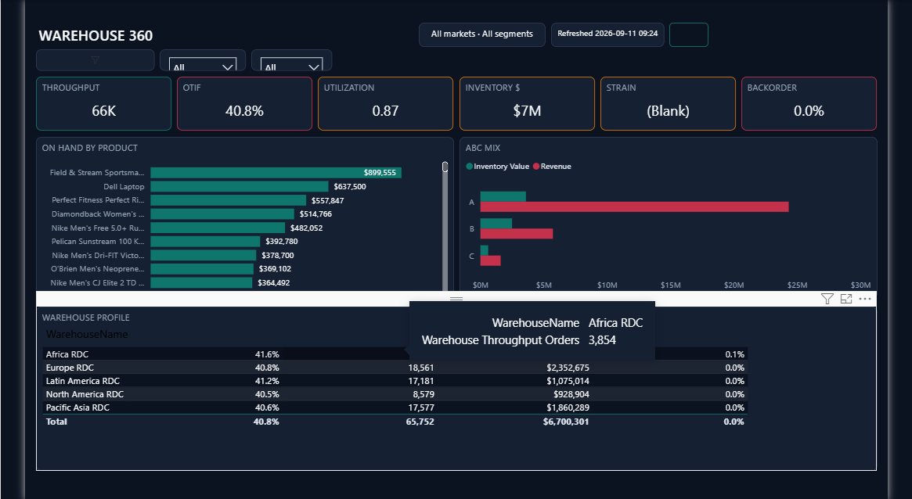
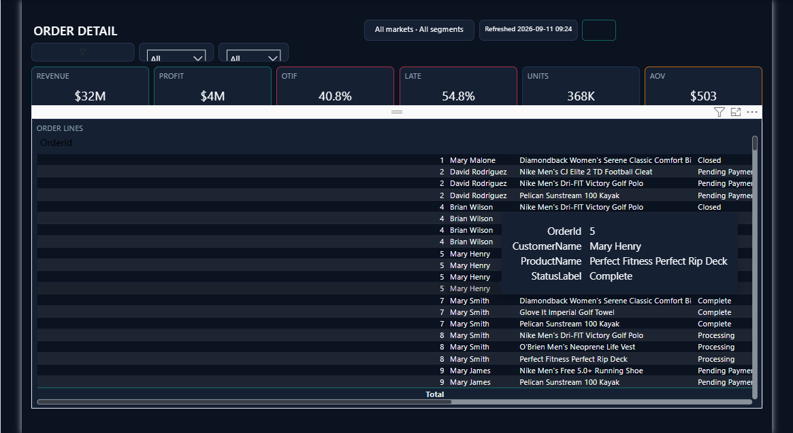

# Supply Chain Control Tower

End-to-end data analyst project for enterprise supply chain performance — Excel dictionary & cleaning log, Python EDA, SQL KPI queries, and a multi-page Power BI control tower covering finance, logistics, inventory, warehouses, procurement, vendors, fulfillment, and sustainability.

**GitHub:** [tnishant082-dev/supply-chain-control-tower](https://github.com/tnishant082-dev/supply-chain-control-tower)

**Open in Power BI Desktop:** [`dashboard/SupplyChain-Control-Tower.pbip`](./dashboard/SupplyChain-Control-Tower.pbip)

---

## Project Overview

Orders, shipments, inventory, and vendor extracts are modeled as a star schema and surfaced in one control tower. Leadership can review service, cost, working capital, and exceptions without hopping across spreadsheets.

Parquet inputs live under `data/`. Demo walkthrough: [`artifacts/supply-chain-control-tower-demo.mp4`](./artifacts/supply-chain-control-tower-demo.mp4)

---

## Business Problem

Operational data usually sits in separate OMS / WMS / TMS / procurement files. Without a shared model it is hard to answer:

- Are we making money after cost to serve?
- What is OTIF, fill rate, and perfect-order performance?
- Where is inventory tied up, and which warehouses are constrained?
- Which carriers, modes, and vendors drive delay or risk?
- What is the freight and CO2 footprint of the network?

---

## End-to-End Workflow

```text
Source extracts (OMS / WMS / TMS / PO)
        │
        ▼
   Excel  ──►  dictionary, cleaning log, KPI / warehouse pivots
        │
        ▼
   Python ──►  flag mix, OTIF checks, mode & inventory charts
        │
        ▼
   SQL    ──►  staging tables, quality checks, control-tower KPIs
        │
        ▼
   Power BI ──► star schema, DAX, bookmarks, RLS, multi-page report
```

| Layer | What it does |
|---|---|
| **Excel** | Field dictionary, staging issues log, executive & warehouse summaries |
| **Python** | Revenue / OTIF reconciliation, transport mix, inventory trend |
| **SQL** | Staging DDL, unknown-key checks, finance / logistics / PO queries |
| **Power BI** | Full control-tower report with time intelligence and RLS roles |

---

## Key Metrics

Figures from the included model (aligned with the live report):

| Area | Metrics |
|---|---|
| **Finance** | Revenue **$32M** · Profit **$4M** · Orders **66K** · Cost to serve **$7M** · Working capital **$14M** |
| **Service** | OTIF **40.8%** · Fill rate **97.8%** · Perfect order **18.8%** · Lead time **3.5 days** |
| **Inventory** | On hand **$7M** · Turns **8.13** · Inv days **408** · Weeks of supply **58** |
| **Logistics** | Freight **$1M** · Cost/ship **$15** · Delay rate **57.3%** · Expedite **20.8%** |
| **Procurement** | PO spend **$35M** · PO count **8,340** · Cycle **4 days** · Preferred mix **80.7%** |
| **Sustainability** | CO2 **386.6 t** · CO2/ship **5.88** · Air share **15.3%** · Ground **79.2%** |

---

## Dashboard Pages

| Page | Focus |
|---|---|
| Executive Command Center | Revenue, profit, orders, cost to serve, working capital |
| Supply Chain Control Tower | OTIF, fill rate, perfect order, turns, lead time |
| Logistics Intelligence | Freight, delay, expedite, carrier scorecard |
| Inventory Command Center | On hand, days/weeks of supply, ABC vs revenue |
| Warehouse Analytics | Throughput, WH OTIF, utilization |
| Warehouse 360 | Node profile drill |
| Procurement Intelligence | PO spend, cycle, preferred mix |
| Vendor Performance Hub | Reliability, SLA, quality, risk |
| Order Fulfillment Analytics | AOV, complete %, perfect order, status |
| Order Detail | Line-level drill |
| Customer 360 | Revenue, return rate, OTIF by customer |
| Sustainability Dashboard | CO2, mode mix, ESG score |

---

## Key Insights

- Service is the pressure point: **OTIF ~41%** and **perfect order ~19%** while fill rate stays high (**~98%**) — in-full is less of an issue than on-time.
- Logistics delay rate is elevated (**~57%** late) with material expedite share (**~21%**); freight is about **$1M** at ~**$15**/shipment.
- Inventory on-hand sits near **$7M** with long coverage (**~408** days / **~58** weeks of supply), pointing to working-capital opportunity.
- Procurement books **~$35M** across **8,340** PO lines at a **4-day** SLA cycle; preferred-vendor mix is strong (**~81%**).
- Sustainability: **386.6 t** CO2 with ground modes dominant (**~79%**) and air around **15%**.

---

## Business Impact

- One place for finance, service, inventory, and vendor reviews
- Faster exception spotting on late shipments and weak OTIF nodes
- Clearer warehouse and carrier scorecards for ops stand-ups
- Traceable path from raw facts → SQL KPIs → Power BI measures
- Support for working-capital and mode-shift discussions with evidence

---

## Data Model / Tools

Star schema across orders, shipments, inventory, procurement, returns, and vendor performance, with conformed dimensions (date, product, customer, region, warehouse, vendor, carrier, transport mode, status).

**Tools:** Power BI · Power Query · DAX · Python (pandas / pyarrow) · SQL · Excel

---

## Repository Structure

```text
excel/         # dictionary, cleaning log, summary tables
sql/           # staging DDL, quality checks, KPI queries
notebooks/     # cleaning + EDA notebook
python/        # KPI helper + optional chart outputs
data/          # star-schema parquet
dashboard/     # .pbip + Report + SemanticModel
screenshots/   # cropped page captures
artifacts/     # silent demo video
requirements.txt
README.md
```

---

## How to open / reproduce

1. Clone the repo
2. `pip install -r requirements.txt`
3. Run `notebooks/01_cleaning_eda.ipynb` (or `python python/run_eda_summary.py`)
4. Export / load parquet facts into staging and run `sql/01_create_staging.sql` → `02_quality_checks.sql` → `03_kpi_queries.sql`
5. Open `dashboard/SupplyChain-Control-Tower.pbip` in Power BI Desktop and refresh against `data/`

---

## Screenshots

### Executive Command Center


Revenue **$32M** · Profit **$4M** · Orders **66K** · Cost to serve **$7M** · Working capital **$14M** · Inventory **$7M**

### Supply Chain Control Tower


OTIF **40.8%** · Fill rate **97.8%** · Perfect order **18.8%** · Turns **8.13** · Inv days **408** · Lead time **3.5 days**

### Logistics Intelligence


Freight **$1M** · Cost/ship **$15** · Delay rate **57.3%** · Expedite **20.8%** · Carrier scorecard

### Inventory Command Center


On hand **$7M** · Days on hand **408** · Weeks of supply **58** · Stockout **0%** · ABC vs revenue

### Warehouse Analytics


Throughput **66K** orders / **384K** units · WH OTIF **40.8%** · Utilization **0.87**

### Warehouse 360



Node profile: throughput, OTIF, utilization, on-hand by product, ABC mix

### Procurement Intelligence


PO spend **$35M** · PO count **8,340** · Cycle **4 days** · Preferred mix **80.7%**

### Vendor Performance Hub


Reliability **0.41** · SLA **40.8%** · Quality **0.96** · Risk **0.33** · Spend **$32M**

### Order Fulfillment Analytics


Orders **66K** · AOV **$503** · Complete **44.1%** · Perfect order **18.8%** · Status breakdown (**$31.6M**)

### Order Detail



Line-level drill: revenue, profit, OTIF, late %, units, AOV

### Customer 360


Revenue **$32M** · Orders **66K** · AOV **$503** · Return **4.3%** · OTIF **40.8%**

### Sustainability Dashboard


CO2 **386.6 t** · CO2/ship **5.88** · Air share **15.3%** · Ground **79.2%** · ESG **85.47**

---

## Author

[Nishant Tyagi](https://github.com/tnishant082-dev)
