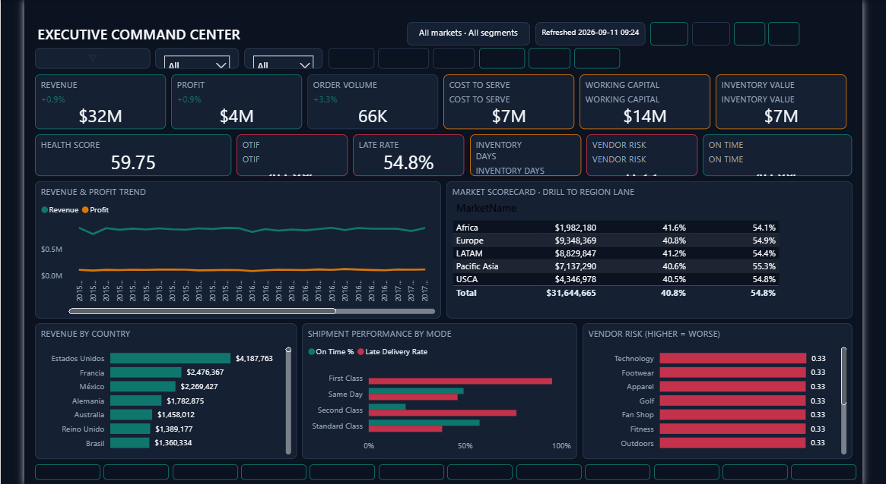
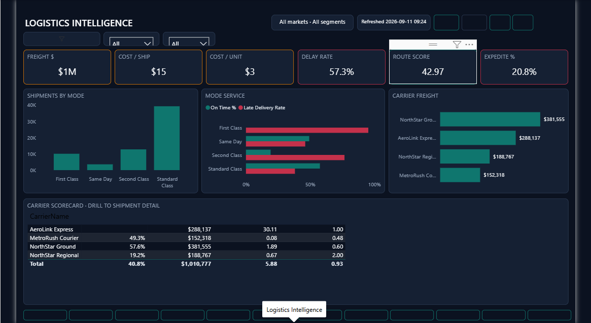
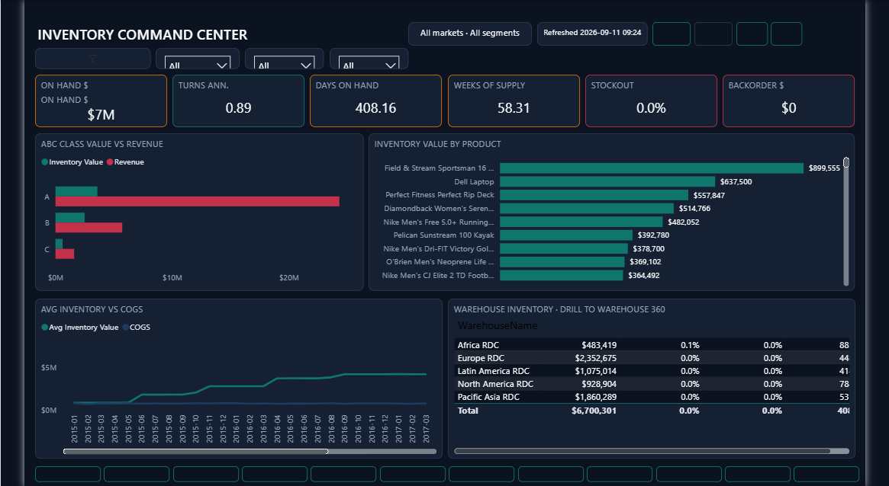
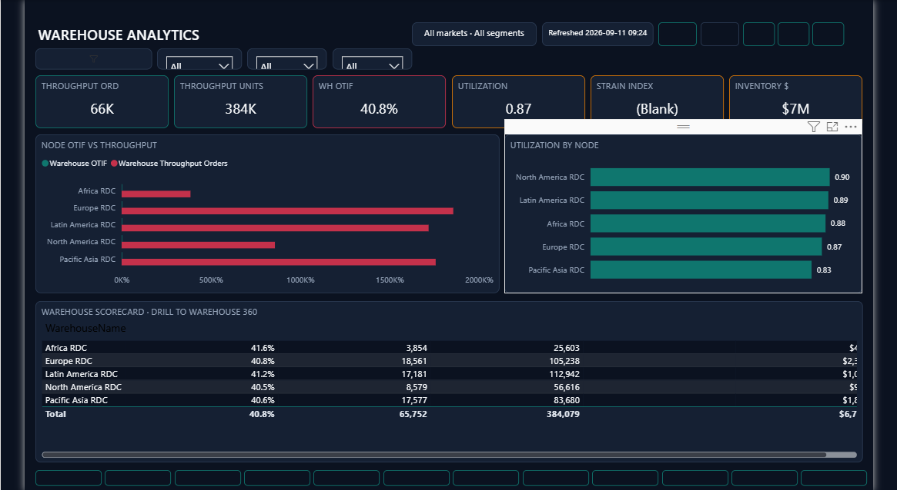
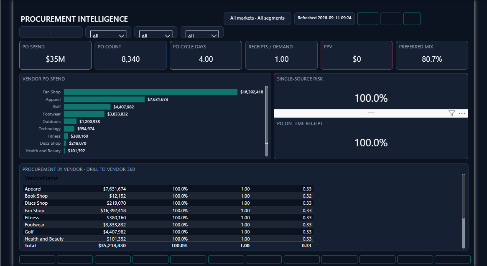
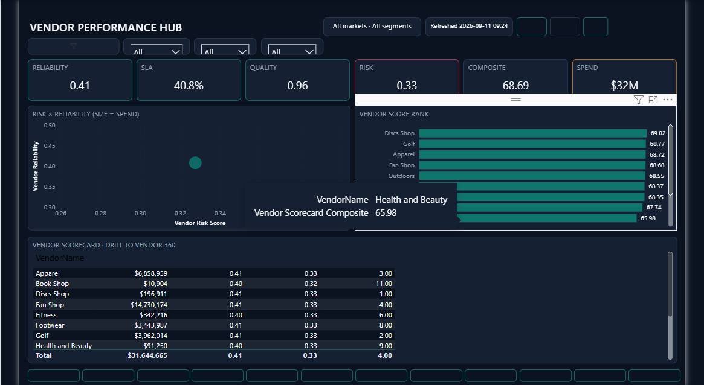
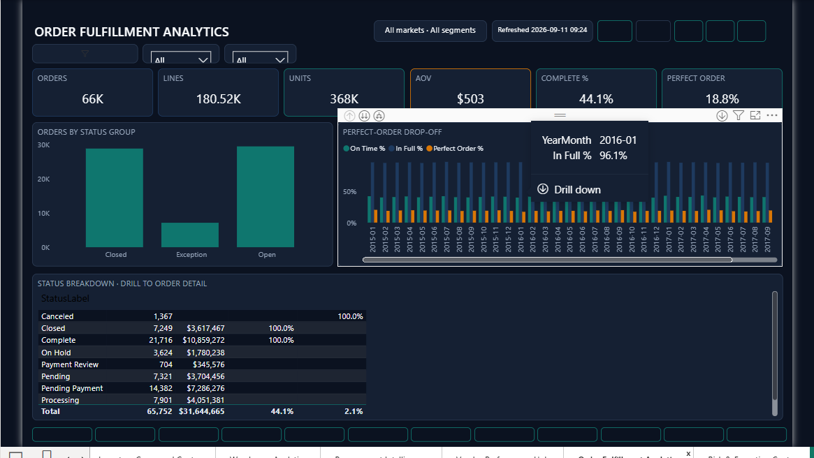
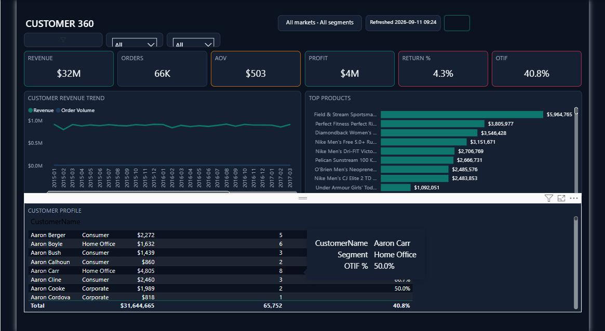
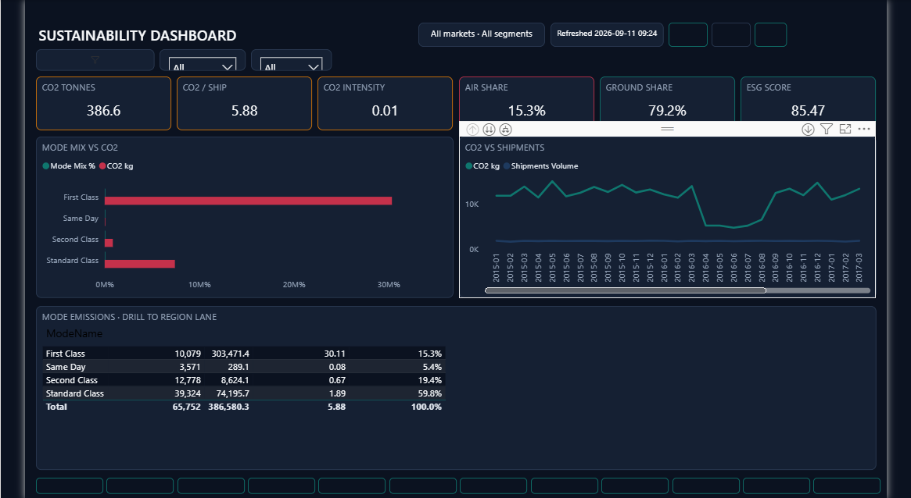

# Supply Chain Control Tower

Analysis of enterprise supply chain performance across orders, shipments, inventory, warehouses, procurement, vendors, and sustainability. Finance, service, and logistics metrics are reviewed together so leadership can see where the network is under pressure and what to investigate first.

**Walkthrough:** [`artifacts/supply-chain-control-tower-demo.mp4`](./artifacts/supply-chain-control-tower-demo.mp4)

---

## Business Problem

Operational data usually sits in separate OMS / WMS / TMS / procurement files. Without a shared view it is hard to answer:

- Are we making money after cost to serve?
- What is OTIF, fill rate, and perfect-order performance?
- Where is inventory tied up, and which warehouses are constrained?
- Which carriers, modes, and vendors drive delay or risk?
- What is the freight and CO2 footprint of the network?

---

## Dashboard Overview

A multi-page interactive control tower for finance, service, logistics, inventory, procurement, and sustainability review. Decision-makers can move from executive KPIs to OTIF, freight, inventory coverage, vendors, fulfillment, and customer cuts in one place.

---

## Key Metrics

| Area | Metrics |
|---|---|
| Finance | Revenue **$32M** · Profit **$4M** · Orders **66K** · Cost to serve **$7M** · Working capital **$14M** |
| Service | OTIF **40.8%** · Fill rate **97.8%** · Perfect order **18.8%** · Lead time **3.5 days** |
| Inventory | On hand **$7M** · Turns **8.13** · Inv days **408** · Weeks of supply **58** |
| Logistics | Freight **$1M** · Cost/ship **$15** · Delay rate **57.3%** · Expedite **20.8%** |
| Procurement | PO spend **$35M** · PO count **8,340** · Cycle **4 days** · Preferred mix **80.7%** |
| Sustainability | CO2 **386.6 t** · CO2/ship **5.88** · Air share **15.3%** · Ground **79.2%** |

---

## Dashboard Pages

### Executive Command Center



- Revenue **$32M**, profit **$4M**, and **66K** orders set the commercial baseline.
- Cost to serve is **$7M**; working capital sits near **$14M**.
- Inventory on hand (**$7M**) is visible alongside P&L so cash and service can be reviewed together.

### Supply Chain Control Tower


- OTIF is **40.8%** while fill rate remains high at **97.8%** — in-full is stronger than on-time.
- Perfect order is **18.8%**; lead time averages **3.5 days**.
- Inventory turns **8.13** with **408** inventory days — coverage is long relative to service gaps.

### Logistics Intelligence



- Freight cost is about **$1M** at ~**$15** per shipment.
- Delay rate is elevated at **57.3%** with expedite share **20.8%**.
- Carrier scorecards help separate mode and partner issues from demand spikes.

### Inventory Command Center



- On-hand inventory is **$7M** with **408** days on hand and **58** weeks of supply.
- Long coverage points to working-capital opportunity if service can hold.
- ABC vs revenue helps prioritize which SKUs deserve attention first.

### Warehouse Analytics



- Throughput is **66K** orders / **384K** units across the network.
- Warehouse OTIF mirrors the network at **40.8%**; utilization averages **0.87**.
- Node comparisons show where capacity and service pressure concentrate.

### Procurement Intelligence



- PO spend is **$35M** across **8,340** purchase orders.
- Cycle time averages **4 days**; preferred-vendor mix is **80.7%**.
- Strong preferred mix still needs SLA and quality follow-through on the vendor hub.

### Vendor Performance Hub



- Reliability sits near **0.41** with SLA **40.8%** — vendor service tracks network OTIF pressure.
- Quality is relatively strong (**0.96**); risk score averages **0.33**.
- Spend of **$32M** makes vendor scorecards material for sourcing reviews.

### Order Fulfillment Analytics



- **66K** orders at AOV **$503**; complete rate **44.1%**.
- Perfect order remains **18.8%** — completion and on-time both need attention.
- Status breakdown (~**$31.6M**) shows where orders stall before delivery.

### Customer 360



- Customer revenue totals **$32M** across **66K** orders (AOV **$503**).
- Return rate is **4.3%**; customer OTIF matches the network at **40.8%**.
- Useful for spotting accounts where service pain and revenue both matter.

### Sustainability Dashboard



- Network CO2 is **386.6 t** (**5.88** per shipment).
- Ground modes dominate (**79.2%**) with air share **15.3%**.
- Mode mix gives a practical lever for footprint discussions alongside freight cost.

---

## Key Findings

1. Service is the pressure point: OTIF ~**41%** and perfect order ~**19%** while fill rate stays high (~**98%**).
2. Logistics delay rate (~**57%**) and expedite share (~**21%**) need carrier and mode review.
3. Inventory coverage is long (**~408** days / **~58** weeks) — working-capital opportunity if service holds.
4. Procurement books **~$35M** with strong preferred mix (~**81%**); vendor SLA still tracks OTIF weakness.
5. Sustainability footprint (**386.6 t** CO2) is mostly ground; air (~**15%**) is the expensive mode lever.

---

## Analysis Process

- Collected and cleaned OMS / WMS / TMS / procurement extracts.
- Validated finance, OTIF, inventory, and freight definitions.
- Performed exploratory analysis on service, logistics, and inventory.
- Investigated warehouse, vendor, and customer patterns.
- Calculated business metrics used in the dashboard.
- Built dashboard pages to highlight operational bottlenecks.

---

## Tools Used

- Power BI
- SQL
- Python
- Excel

---

## Repository Structure

```text
data/          cleaned tables (csv / xlsx / parquet)
excel/         dictionary, cleaning log, summary
sql/           KPI and quality queries
python/        EDA / cleaning / feature scripts
dashboard/     Power BI project (.pbip)
screenshots/   dashboard page images
artifacts/     walkthrough video
```

---

## How to View

1. Open `dashboard/SupplyChain-Control-Tower.pbip` in Power BI Desktop
2. See [`screenshots/`](./screenshots/)
3. Watch [`artifacts/supply-chain-control-tower-demo.mp4`](./artifacts/supply-chain-control-tower-demo.mp4)

---

## Author

Nishant Tyagi
